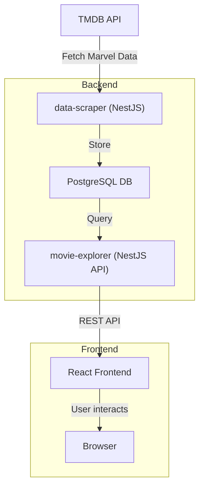

# Marvel Movie Data Explorer – Vi Home Assignment

## Assignment Overview
This project is a full-stack MVP for exploring Marvel movies, actors, and characters, built as a home assignment for Vi. The goal is to answer questions such as:
- Which Marvel actors have played multiple characters?
- Which characters have been portrayed by multiple actors?
- Which movies has each actor appeared in?

The application fetches and processes data from the TMDB API, stores it in a database, and exposes endpoints and a simple UI to explore the data.

---

## Architecture & Service Design

**High-Level Overview:**
- The project consists of two main services: a NestJS backend and a React frontend.
- Data flows from the TMDB API → backend data-scraper → PostgreSQL database → backend API endpoints → frontend UI.



**Backend (`marvel-service`):**
- **data-scraper module:** Fetches Marvel movie/actor/character data from TMDB, handles rate limiting and retries, and loads data into the database.
- **movie-explorer module:** Exposes REST API endpoints for querying movies, actors, and characters. Implements pagination and efficient DB queries.
- **Database:** PostgreSQL with a normalized schema (movies, actors, characters, associations), designed for scalability and extensibility.

**Frontend (`marvel-webapp`):**
- **Pages:** Three main pages, each corresponding to a core API endpoint.
- **API Integration:** Uses a central API utility to fetch data from the backend.
- **UI:** Built with Material-UI, with a focus on clarity and extensibility.

---

## How This Solution Meets the Assignment

**Backend:**
- **Tech:** Node.js (NestJS), PostgreSQL, TypeORM
- **Data Acquisition:** Fetches Marvel movie/actor/character data from TMDB API (with rate limiting, retries, and error handling)
- **Database:** Efficient schema with UUIDs, ready for scale and extensibility
- **Endpoints:**
  - `/moviesPerActor` – List of movies per actor
  - `/actorsWithMultipleCharacters` – Actors who played multiple Marvel characters
  - `/charactersWithMultipleActors` – Characters played by multiple actors
- **Extensibility:** Designed for larger datasets and future features

**Frontend:**
- **Tech:** React, TypeScript, Material-UI
- **Pages:**
  - Movies per Actor (select actor, see movies)
  - Actors with Multiple Characters (see actors, movies, and characters)
  - Characters with Multiple Actors (see characters, movies, and actors)
- **Design:** Simple, extensible, with empty states and Material-UI styling

---

## Technology Stack
- **Backend:** Node.js, NestJS, TypeScript, PostgreSQL, TypeORM, Docker
- **Frontend:** React, TypeScript, Material-UI, Docker
- **Other:** Bottleneck (rate limiting), p-retry (API retries)

---

## Setup Instructions

### Prerequisites
- Docker installed
- (Optional) Node.js & npm for local development

### 1. Clone the Repository
```sh
git clone <repo-url>
cd vi-home-assignment
```

### 2. Configure Environment Variables
- Add your TMDB API key to `backend/marvel-service/.env.test`:
  ```
  TMDB_API_KEY=<your_tmdb_api_key>
  ```
  (A sample key is provided in the assignment for testing.)

### 3. Start the Application
From the project root, run:
```sh
./scripts/start_local.sh
```
This will start both backend and frontend (dockerized).

### 4. Populate the Database
After services are up, run:
```sh
curl -X POST http://localhost:3000/data-scraper/scrape-movies
```
This fetches and loads Marvel data from TMDB.

### 5. Access the UI
Open your browser at [http://localhost:3001](http://localhost:3001)

---

## How to Use
- **Movies Per Actor:**
  - Select an actor from the list to see all Marvel movies they appeared in.
- **Actors with Multiple Characters:**
  - View actors who played more than one Marvel character, with details per movie/character.
- **Characters with Multiple Actors:**
  - View Marvel characters portrayed by multiple actors, with details per movie/actor.

---

## Project Structure
```
vi-home-assignment/
  backend/marvel-service/   # NestJS backend
    src/
      data-scraper/         # TMDB data fetching
      movie-explorer/       # API endpoints & DB logic
  frontend/marvel-webapp/   # React frontend
    src/pages/              # Main UI pages
  scripts/start_local.sh    # Startup script
```

---

## Assumptions & Design Decisions
- **Data Scope:** MVP uses a small, static list of Marvel movies/actors (see `movies-and-actors.json`), but schema and logic are ready for larger datasets.
- **API Design:** Endpoints are simple and focused for MVP; future versions could use more RESTful/HATEOAS patterns.
- **Performance:** Pagination on all endpoints; backend and DB ready for scale; rate limiting and retries for TMDB API.
- **Extensibility:** DB schema supports adding more entities (e.g., directors), multiple data providers, and future features.
- **UI:** Minimal, but easily extensible; Material-UI for consistency.
- **Testing:** One e2e backend test (runs scraper, checks endpoints); no frontend tests due to time constraints.

---

## Future Improvements
- Add search, sorting, and filtering in the UI
- More RESTful API design
- More comprehensive test coverage (frontend & backend)
- Support for additional data providers
- Caching layer for heavy read scenarios
- User authentication and personalization

---

## Credits
- Assignment by Vi
- Data from [TMDB API](https://www.themoviedb.org/documentation/api)
- Developed by Guy Manzurola


